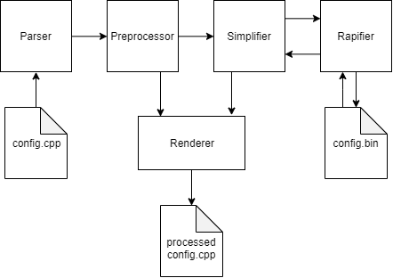

# Arma Lint - Config

Arma Config Files (config.cpp / Description.ext)



## Parser

The ArmaLint Config parser creates a full Abstract Syntax Tree of the config file, its includes, and its PreProcessor Commands. Macros are also parsed into their AST version to ensure accurate syntax.

## Preprocessor

The ArmaLint Config preprocessor tries to act as closely as possible to one found in Arma 3. It processes the entire file while preserving where each part of a line was originally written.

### CURRENTLY UNSUPPORTED
__EXEC  
__EVAL  
enum

## Renderer

The ArmaLint Config renderer can be used to create a processed version of a config file. All preprocessor commands like includes, macros, and defines can be seen after they have been executed.

Since the parser also turns macros into their AST version, the renderer can apply the selected style to generated code.

```hpp
#define CAR(name,clr) class name: car {\
    displayName = QUOTE(name - clr); \
    color = #clr; \
    line = __LINE__; \
}

class car;
class CfgCars {
    CAR(Avenger, red);
    CAR(Titan, black);
    CAR(Elemental, green);
};
```

The following code can be rendered with two different bracket styles:

### Allman
```hpp
class car;
class CfgCars
{
  class Avenger: car
  {
    displayName = "Avenger - red";
    color = "red";
    line = 9;
  };
  class Titan: car
  {
    displayName = "Titan - black";
    color = "black";
    line = 10;
  };
  class Elemental: car
  {
    displayName = "Elemental - green";
    color = "green";
    line = 11;
  };
};
```

### Linux
```hpp
class car;
class CfgCars {
  class Avenger: car {
    displayName = "Avenger - red";
    color = "red";
    line = 9;
  };
  class Titan: car {
    displayName = "Titan - black";
    color = "black";
    line = 10;
  };
  class Elemental: car {
    displayName = "Elemental - green";
    color = "green";
    line = 11;
  };
};
```


## Simplifier

The ArmaLint Config simplifier is used to create a version of the config that is ready to be rapified.

## Rapifier

The ArmaLint Config rapifier is capable of reading and writing rapified config files.
